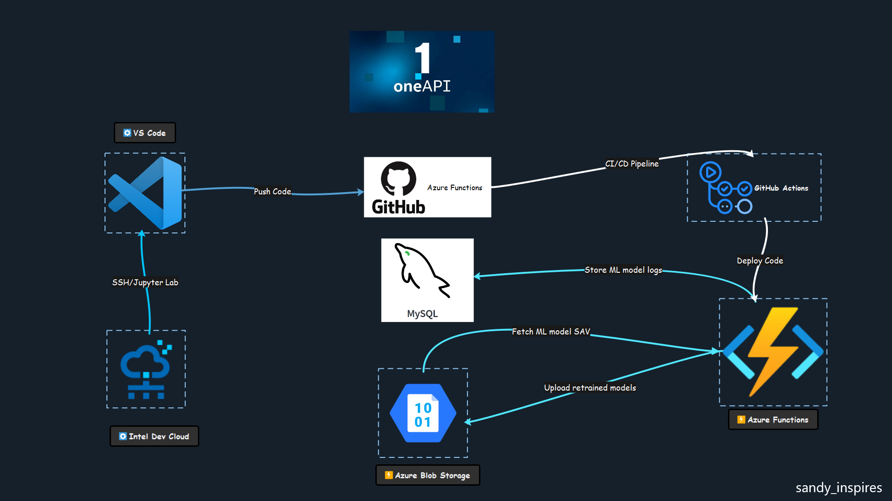

# Sandy Inspires - Predict the quality of water - Intel oneAPI Hackathon 2023

Deploying a binary classification model on Azure Function to do on-demand predictions at scale powered by Intel oneAPI AI Analytics Toolkit. We have multiple versions of the model with varying f1 scores - the latest model has 94 as it's f1 score. Integrated GitHub actions with GitHub repo to make seamless deployment of new code into Azure Function by simply pushing code to main brach or merging code with main branch. It's also important to understand how our model is performing so we are logging the model metrics in a MySQL database for further analytics, gathering deeper insights to improve the model, and analyze model usage.

`Project Published on DevMesh Portal` - [Project Link](https://devmesh.intel.com/projects/fresh-water-classification-using-intel-oneapi-ai-analtyics-toolkit-sandy-inspires)

## Architecture Diagram


## YouTube Demo Video 📺📺
### [Click here to watch the demo](https://www.youtube.com/watch?v=hG8o02FAzAY&ab_channel=LateNightCodewithSanthosh)

### Step to import the Postman collection
- Open your Postman application
- Press Ctrl+O or got to File> Import
- Select the JSON file and choose the collection name to complete the import

[Click here to read more about importing a Postman collection](https://learning.postman.com/docs/getting-started/importing-and-exporting-data/#importing-data-into-postman)


## Azure Functions API endpoints

Download the Postman API Collection which has sample API endpoints and JSON request body

Base Request URL - https://sandy-intel-one-api-fresh-water-classifier.azurewebsites.net

Sample request URLs
- https://sandy-intel-one-api-fresh-water-classifier.azurewebsites.net/api/predict

`Note: The first time you try to access this endpoint it might be slow but once it loads up then you can hit the endpoint frequently and get a quick response (300 to 750 ms)`

## System Specifications
- 16 GB DDR4
- Intel i7-8750H @ 2.20 GHz with 6 cores
- Nvidia GeForce GTX 1060 with 6 GB VRAM
- Samsung 256 GB SSD M.2 NVME

## Http Method

### POST

#### /api/predict

Get the prediction for fresh water.

## Request parameters

1) `mode` (str, required)

Mode of operation, do prediction or just describe the model (predict or model_describe)

2) `features_dict` (dict. required if mode is predict) 

Input features for detection

3) `model_version` (str, optional)

Version of the model you want to use (v1, v2 or latest)<br>
Defaults to `latest`

4) `get_probability` (bool, optional)

If set to true, the request should return the probability of the classes<br>
Defaults to false

5) `get_feature_importance` (bool, optional)

If set to true, returns the importance of each feature the model was trained on<br>
Defaults to false

6) `get_model_features` (bool, optional)

If set to true, returns the feature columns the model was trained on<br>
Defaults to false

7) `skip_db_update` (bool, optional)

If set to true, skips the prediction update to db and make the response time faster

```NOTE: The response time recorded is the time when the request first hits the Azure Function endpoint and the prediction is made```

## Request headers

`Content-Type` (required) string  

Media type of the body sent to the API. (application/json)

`NOTE: it's an public API endpoint so no authentication required. Never run public public endpoints in production`

## Setup environment variable (incase you want to deploy this code)
#### Please set the below variables
- MYSQL_HOST - MySQL host name
- MYSQL_USERNAME - MySQL username
- MYSQL_PASSWORD - MySQL user password
- LATEST_MODEL_VERSION - the latest version of the model (v1.1, v2.0, v3.1)
- AZURE_BLOB_STORAGE_MODEL_CONTAINER_PATH - the private url of the Azure Blob Storage Container

## Request Sample

Sample request body for prediction:

```
{
    "features_dict": {
        "pH": 5.916054662638588,
        "Iron": 2.61964963700558,
        "Nitrate": 1.389334381478444,
        "Chloride": 84.5131075606675,
        "Lead": 3.337545563272474,
        "Zinc": 1.9780321533559888,
        "Turbidity": 0.2486518821452759,
        "Fluoride": 1.6913182398790103,
        "Copper": 2.96396750718677,
        "Odor": 0.7721724045887509,
        "Sulfate": 83.81345037627716,
        "Conductivity": 150.0865646653724,
        "Chlorine": 5.966623674745241,
        "Manganese": 0.011527500694864,
        "Total Dissolved Solids": 52.36944624557778,
        "Water Temperature": 10.404331788327024,
        "Air Temperature": 42.50801106306919,
        "Day": 12.0,
        "Time of Day": 23.0,
        "Color": "Faint Yellow",
        "Source": "Spring",
        "Month": "January"
    },
    "model_version": "v3.1",
    "mode": "predict",
    "get_probability": true,
    "get_feature_importance": true,
    "get_model_features": true,
    "skip_db_update": false
}
```


## Response 200
The response include the extracted features in JSON format.

```
{
    "prediction": "unsafe to consume",
    "predicted_class": 1,
    "probability": {
        "0": 0.137430036277229,
        "1": 0.8625699637227712
    },
    "feature_columns": [
        "pH",
        "Iron",
        "Nitrate",
        "Chloride",
        "Lead",
        "Zinc",
        "Turbidity",
        "Fluoride",
        "Copper",
        "Odor",
        "Sulfate",
        "Conductivity",
        "Chlorine",
        "Manganese",
        "Total Dissolved Solids",
        "Water Temperature",
        "Air Temperature",
        "Day",
        "Time of Day",
        "clr_Colorless",
        "clr_Faint Yellow",
        "clr_Light Yellow",
        "clr_Near Colorless",
        "clr_Yellow"
    ],
    "feature_importance": [
        0.12017251721100342,
        0.04478049911178525,
        0.049991602509767086,
        0.10288805321208315,
        0.0028985012030458405,
        0.010577532597023298,
        0.117509626488281,
        0.03940611510067235,
        0.09685049859506778,
        0.09071415904793474,
        0.02264432579188263,
        0.0004588714689250585,
        0.04258370095734564,
        0.15877773417279717,
        0.028935966463589962,
        0.00046330029603573237,
        0.00048460608389740123,
        0.0002611789029007828,
        0.00025087763724318703,
        0.007557150563553395,
        0.002085750572472046,
        0.006163260421078578,
        0.005956294689692912,
        0.04758787690192163
    ],
    "response_time": 0.0855,
    "log_source": "azure"
}
```